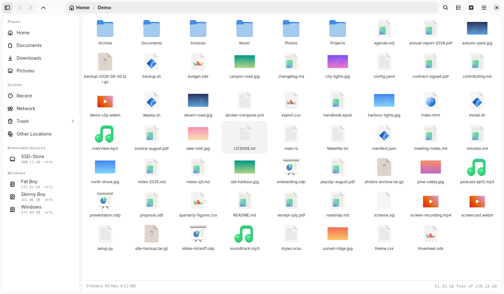

<div align="center">


# Fileman

**A fast GTK4 file manager for Linux, written in Rust.**

Browse, copy, move, rename — plus the things that usually send you to a
terminal: NTFS drives Windows left dirty, LUKS volumes, any archive format,
and downloads.

</div>



## Install

```sh
curl -fsSL https://raw.githubusercontent.com/0znio/fileman/main/install.sh | sh
```

Works out what your machine needs: installs dependencies with your own package
manager (apt, pacman, dnf, zypper, apk, xbps, emerge, eopkg), then downloads the
prebuilt binary — or builds from source if a binary won't run here.

> **Prebuilt binary needs** glibc ≥ 2.39, GTK ≥ 4.12, libadwaita ≥ 1.5 —
> Ubuntu 24.04+, Debian 13+, Fedora 40+, Arch, openSUSE Tumbleweed.
> Older, musl, or non-x86_64 builds from source instead.

Options go after `-s --`, since the script is piped into `sh`:

```sh
curl -fsSL .../install.sh | sh -s -- --from-source --prefix /usr/local
```

| Option | Effect |
| --- | --- |
| `--from-source` | Build with cargo instead of downloading |
| `--prefix DIR` | Install under `DIR` (default `/usr/local`, or `~/.local` without root) |
| `--version TAG` | A specific release |
| `--no-deps` | Leave the package manager alone |
| `--uninstall` | Remove it again |

<details>
<summary><b>From source, or manual download</b></summary>

Needs Rust 1.92+ and dev headers for `gtk4`, `libadwaita`, `libarchive`.

```sh
git clone https://github.com/0znio/fileman.git && cd fileman
make && make test
make install                      # ~/.local, no root
sudo make install PREFIX=/usr/local   # system-wide
```

Or grab the tarball from the [latest release](https://github.com/0znio/fileman/releases/latest):

```sh
curl -fsSLO https://github.com/0znio/fileman/releases/latest/download/SHA256SUMS
curl -fsSLO https://github.com/0znio/fileman/releases/latest/download/fileman-0.2.0-x86_64-linux.tar.gz
sha256sum -c SHA256SUMS
tar -xzf fileman-*-x86_64-linux.tar.gz && cd fileman-*-x86_64-linux
install -Dm755 fileman ~/.local/bin/fileman
```

Runtime needs `gtk4`, `libadwaita`, `libarchive`, `udisks2` and a polkit agent.
Optional: `pigz` (threaded `.tar.gz`), `ntfs-3g` (dirty NTFS), `ntfsprogs`
(`ntfsfix`, repairs them properly).

</details>

## What it does

**Browsing** — tabs with their own history and scroll position · icon grid and
details list · breadcrumb that becomes an editable path · recursive search that
streams results as it walks · thumbnails from the shared freedesktop cache ·
drag and drop · light/dark and a pick-your-own accent colour.

**Drives** — every mountable volume in the sidebar with a capacity ring, grouped
into Removable, Windows and internal. Mounts through UDisks2 as your own user:
no `sudo`, no fstab, no `/dev/sdX` that breaks on replug. LUKS volumes prompt for
a passphrase and unlock.

**NTFS that Windows left dirty** — with Fast Startup on, that's *every* normal
shutdown. Most file managers show you the driver error and stop. Fileman offers
read-only, a proper repair, or a forced mount, and remembers which driver worked.

**Archives** — extract zip, 7z, rar/rar5, tar with any compressor, cab, iso, deb,
rpm and more, in-process through libarchive with real progress and cancel.
Create zip, tar.gz, tar.xz, tar.zst, 7z.

**Downloads** — `Ctrl+Shift+D` takes a URL, asks the server for the real name and
size, lets you rename and pick a folder, then fetches it across several
connections. Share links from Google Drive, pixeldrain, GitHub, Dropbox and
gofile are rewritten to the file they point at, and a reply that turns out to be
a login page or an ISP block is reported instead of being saved as your `.zip`.

**Network shares** — connect to SMB, SFTP, FTP, WebDAV or NFS from the sidebar.
Saved servers stay listed whether or not they're mounted; passwords go to your
login keyring through gvfs, never to Fileman.

**Cloud drives** — Google Drive, Proton Drive, Icedrive, Dropbox, OneDrive and
Nextcloud, mounted as ordinary folders so copy, search and compress all work on
them. Each account is listed with the address it signed in as, so two Google
Drives stay apart. Needs [rclone](https://rclone.org), which holds the
credentials.

**Deleting** — Trash by default and undoable. `Shift+Delete` is permanent;
`Ctrl+Shift+Delete` shreds, and tells you when your filesystem makes that
promise meaningless.

## Fast

Measured on a 446 MB / 36,700-file corpus, ext4 on NVMe, 8 threads.

| | Before | After |
| --- | --- | --- |
| Compress `.tar.xz` | 77.7 s | **16.6 s** |
| Compress `.tar.gz` | 6.29 s | **1.03 s** |
| Extract `.tar.xz` | 2.57 s | **1.70 s** |
| Shred 2000 × 8 KB | 9.31 s | **1.79 s** |
| List an 8,463-file folder | 613 ms | **62 ms** |
| Download 140 MB | 34.3 s | **9.1 s** |

Jobs use half your cores by default, so a long compress doesn't make the desktop
stutter. Settings → Performance overrides it.

<details>
<summary><b>Why</b></summary>

- **libarchive compresses on one core** unless told otherwise. liblzma and
  libzstd split input into independent blocks, so they just needed a thread
  count. Deflate has no threaded encoder, so `.tar.gz` pipes through `pigz`.
- **Extraction read every archive twice** — once to list, once to extract, and
  listing a `.tar.gz` means decompressing all of it. Entries now land in a
  staging directory and are moved into place with one `rename`.
- **Shredding is bound by `fsync` latency, not bandwidth.** Files shred on
  several threads that sit blocked in `fsync` costing almost no CPU, while the
  device coalesces their commits.
- **Listing** asked gio for `standard::content-type`, which costs a mime lookup
  per file and an open-and-read for anything it can't name from the filename.
  Fileman derives it itself, memoised on the name's suffix.
- **Downloads** split across connections when the server sends `Accept-Ranges`;
  byte-identical output, falling back to one stream when it won't.
- **Deleting was left alone deliberately** — parallel `unlink` measured
  completely flat on ext4, because the journal serialises it.

`FILEMAN_TRACE=1` reports scan times and main-loop stalls.
`FILEMAN_SNAPSHOT=<path>` renders the window to a PNG and exits.

</details>

## Shortcuts

`Ctrl+?` lists them all in the app.

| Key | Action |
| --- | --- |
| `Ctrl+T` / `Ctrl+W` / `Ctrl+Tab` | New tab / close / cycle |
| `Alt+←` `Alt+→` `Alt+↑` | Back / forward / up |
| `Ctrl+L` / `Ctrl+F` / `Ctrl+H` | Edit path / search / hidden files |
| `F2` · `Delete` · `Shift+Delete` · `Ctrl+Shift+Delete` | Rename · trash · delete · shred |
| `Ctrl+E` / `Ctrl+Shift+E` | Extract here / compress |
| `Ctrl+Shift+D` | Download from a URL |
| `Ctrl+D` / `Ctrl+Shift+V` / `Alt+Return` / `F9` | Favourite / grid↔list / properties / sidebar |

Selection keys act on the file list, so text boxes keep their own.

<details>
<summary><b>How dirty NTFS is handled</b></summary>

| Option | What it does | Risk |
| --- | --- | --- |
| **Repair and mount** (default) | `ntfsfix -d` clears the dirty flag and schedules Windows' chkdsk | Low; needs admin |
| **Open read-only** | Browse and copy files off | None |
| **Force read-write** | Mounts with `remove_hiberfile`, discarding the hibernation image | Files untouched, but a suspended Windows session can't resume |

The in-kernel `ntfs3` driver rejects dirty volumes, and it's what you get by
default — `blkid` reports them as `ntfs` and the kernel resolves that name
straight to `ntfs3`. So retrying with `fstype=ntfs` changes nothing; Fileman asks
for `ntfs-3g`, which UDisks2 routes through the FUSE helper instead.

Which driver worked is remembered per volume UUID. Every mount attempt is a
UDisks2 job that other desktop components watch — `udiskie` reports a failed
first attempt even when the retry succeeds — so getting it right first time is
the only way to keep that quiet.

</details>

<details>
<summary><b>What shredding can and can't promise</b></summary>

Overwriting before unlinking works on a filesystem that overwrites in place
(ext4 without data journalling, XFS, vfat, NTFS) on magnetic media. It is *not*
a guarantee on copy-on-write filesystems or flash, so Fileman detects btrfs,
ZFS, bcachefs, overlayfs, F2FS, tmpfs, network mounts and SSDs and says exactly
why the guarantee doesn't hold before you commit.

Files are overwritten with random data, finish with a zero pass, `fsync`ed after
each, truncated, renamed, then unlinked. Symlinks are unlinked, not followed.

</details>

<details>
<summary><b>Source layout</b></summary>

```
src/
  app.rs        application, command line, stylesheet, debug hooks
  config.rs     settings, persisted atomically to ~/.config/fileman
  fs/           entry model, scanning, copy/move/delete, trash, shredding,
                recent files, parallel downloads, the shared thread budget
  archive/      libarchive extraction and bsdtar creation
  drives/       UDisks2 over D-Bus, NTFS recovery, LUKS unlocking
  ui/           window and tabs, actions, sidebar, path bar, views, dialogs
```

Long operations run on worker threads and report through an async channel.
Conflicts hand the UI a one-shot reply channel and block the worker on it, so the
decision stays synchronous with the copy loop without the worker touching a
widget.

</details>

## Known gaps

No split view · renaming several files at once · video and document thumbnails ·
search matches names, not contents · each network protocol needs its own gvfs
backend installed, and the connect dialog says which · not yet a desktop
file-chooser backend, so browsers still use the GTK save dialog.

## Licence

MIT
